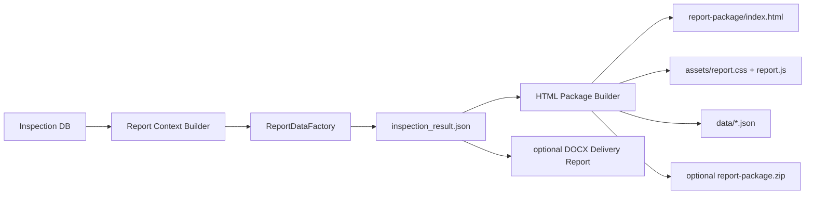

# VStackLens V1.0 Report Engine Architecture

## Design Goal

VStackLens uses one report data contract for every export format.

Inspection data is transformed into report context and `ReportData` once, persisted as JSON files, and then rendered by templates.

No report format is allowed to query inspection tables directly or implement business logic independently.

## Export Chain

## Current M2 Behavior

- Primary output: Browser HTML Report Package
- Core entry: `report-package/index.html`
- Data files: `data/report_context.json`, `data/inspection_results.json`, `data/findings.json`, `data/assets.json`, `data/rule_catalog.json`, `data/capability_gaps.json`, `data/inspection_result.json`
- Optional archive: `report-package.zip`
- Optional delivery document: DOCX through `--docx-out`
- Not implemented for V1.0: PDF and PPTX

## ReportData Sections

- `report_info`
- `customer_info`
- `environment_summary`
- `health_score`
- `risk_summary`
- `risk_distribution`
- `asset_inventory`
- `findings`
- `recommendations`
- `remediation_plan`
- `appendix`

The browser package also includes object-level inspection results and the full rule catalog:

- `object_results`
- `object_pass_rate`
- `rule_pass_rate`
- `module_summary`
- `rule_catalog`
- `capability_gaps`

## Rule Execution Policy

Rules have lifecycle and execution metadata:

- `implementation_status`: `implemented`, `planned`, `optional_plugin`, `deprecated`
- `execution_mode`: `default_enabled`, `disabled_by_default`, `optional_enabled`, `plugin_required`
- `capability_required`: capability names such as `pyvmomi`, `datastore_latency_metric`, `offline_baseline`
- `report_visibility`: report placement hints
- `scoring_eligible`: whether failed results should affect health score

The default run only executes `implemented + default_enabled` rules.

Planned, optional plugin, and disabled-by-default rules remain visible in the full rule catalog and capability gap section, but they do not create rule results, unavailable results, pass-rate entries, or health-score deductions.

## Template Rule

Template engines can format, paginate, group, and style data.

Template engines must not decide whether an object is risky, calculate scores, or reinterpret rule evidence.
